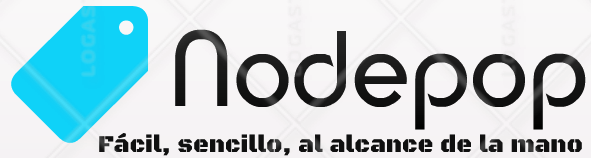

Fácil, sencillo, al alcance de la mano.

**Práctica JS/Node.js/MongoDB - KeepCoding Startup Engineering Master IV**

Backend de soporte a una aplicación de venta de artículos de segunda mano.

## Instrucciones
Requisitos de instalación:
- Node >= 4.0
- MongoDB
- Git

## Instalación
### Descarga del Backend
	$ git clone https://github.com/JoseJacin/KeepCoding-IVEdicion-KeepcodingMasterBootcamp-JS_Node.js_MongoDB-PracticaNodepop.git nodepop
	$ cd nodepop
	$ npm install

### Instalación de la Base de Datos
	$ npm run-script installDB

### Arrancar la Base de Datos
	$ npm run-script startDB

### Arrancar el servidor
	$ npm start

### URL de la aplicación
  * [josesanchezrodriguez.es](josesanchezrodriguez.es)

### URL de Imagen estática servida por Nginx
  * [https://josesanchezrodriguez.es/img/intro-bg.jpg](https://josesanchezrodriguez.es/img/intro-bg.jpg)

## Operaciones disponibles
- **Registro** - Registro de usuario (nombre, email, contraseña)
- **Autenticación** - Login de usuario (email, contraseña)
- **Lista de anuncios** - Búsqueda de anuncios (paginada, con filtros de búsqueda)

## Documentación
  * [Nodepop](https://github.com/JoseJacin/KeepCoding-IVEdicion-KeepcodingMasterBootcamp-JS_Node.js_MongoDB-PracticaNodepop/blob/master/README.md)
  * [Ruta de imágenes de anuncios/bici](https://github.com/JoseJacin/KeepCoding-IVEdicion-KeepcodingMasterBootcamp-JS_Node.js_MongoDB-PracticaNodepop/blob/master/public/images/Anuncios/bici.jpg)
